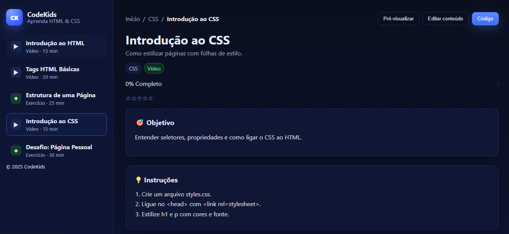

# CodeKids — HTML & CSS 👩‍🏫👨‍🏫

[](https://JvictorGarcia.github.io/codekids-html-css/)


Landing page educacional para um curso rápido de **HTML & CSS** voltado a **jovens do ensino médio**.  
Site responsivo, acessível e simples de manter (deploy via **GitHub Pages**).

> 🔗 **Demo**: https://JvictorGarcia.github.io/codekids-html-css/

---

## 📸 Preview



---

## ✨ Features
- Layout moderno com **sidebar de aulas** e área principal de conteúdo
- Seções: **Objetivo**, **Instruções**, **Código inicial (copiar)**, **Apostilas**, **Vídeo-aulas**, **Galeria**
- **Responsivo** e com foco em **acessibilidade** (skip link, contraste, hierarquia)
- Estilos separados em `assets/css/styles.css`
- Pronto para **GitHub Pages**

---

## 🧱 Estrutura
codekids-html-css/
├─ index.html # Entrada (liga para as demais páginas)
├─ intro-html.html
├─ tags-basicas.html
├─ estrutura-pagina.html
├─ introducao-css.html
├─ desafio-pessoal.html
├─ assets/
│ └─ css/
│ └─ styles.css
└─ docs/
└─ preview.png # Imagem usada no README


---

## 🚀 Como rodar localmente
1. Baixe/clonar:
   ```bash
   git clone https://github.com/JvictorGarcia/codekids-html-css.git
   cd codekids-html-css
